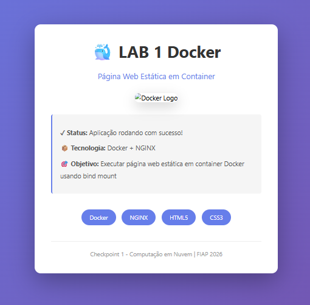
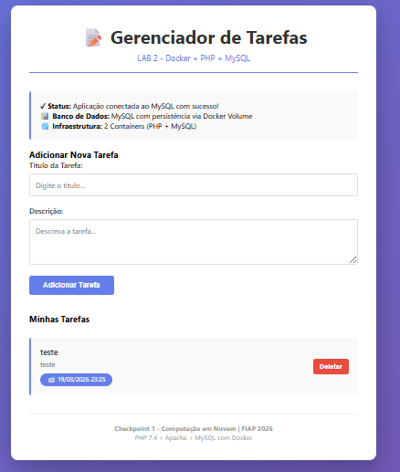
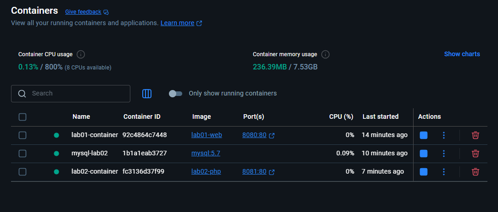
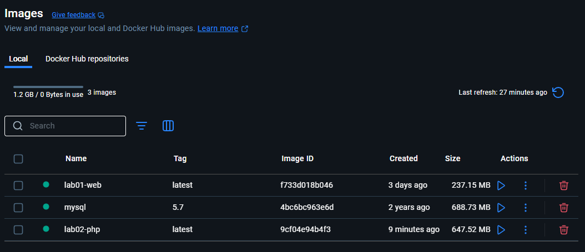

# Checkpoint 1 - Docker - Computação em Nuvem FIAP 2026

##  Visão Geral

Este repositório contém dois laboratórios práticos de Docker, demonstrando:
1. **LAB 1**: Página web estática em container NGINX com bind mount
2. **LAB 2**: Aplicação PHP com banco MySQL em múltiplos containers e persistência de dados

##  Descrição dos LABs

###  LAB 1: Página Web Estática

| Item | Descrição |
|------|-----------|
| **Objetivo** | Executar página HTML estática em container Docker |
| **Tecnologia** | NGINX + HTML5 + CSS3 |
| **Porta** | 8080 |
| **Mount** | Bind mount do arquivo index.html |
| **Compose** |  Sem Docker Compose |

**Localização**: `./lab01/`

###  LAB 2: Aplicação PHP + MySQL

| Item | Descrição |
|------|-----------|
| **Objetivo** | Aplicação completa com banco de dados |
| **Tecnologia** | PHP 7.4 + Apache + MySQL 5.7 |
| **Porta** | 8081 (PHP) + 3306 interno (MySQL) |
| **Armazenamento** | Docker Volume (mysql-volume) |
| **Aplicação** | Gerenciador de Tarefas com CRUD |
| **Compose** |  Sem Docker Compose |

**Localização**: `./lab02/`

##  Estrutura do Repositório

```
.
├── lab01/                          # LAB 1: Página Estática
│   ├── Dockerfile                  # Configuração NGINX
│   ├── index.html                  # Página da aplicação
│   └── README.md                   # Instruções detalhadas
│
├── lab02/                          # LAB 2: PHP + MySQL
│   ├── Dockerfile                  # Configuração PHP/Apache
│   ├── app/
│   │   └── index.php               # Aplicação gerenciador tarefas
│   └── README.md                   # Instruções detalhadas
│
└── README.md                       # Este arquivo
```

##  Documentação Detalhada

Para instruções passo a passo, veja:
- [LAB 1 - Instruções Completas](./lab01/README.md)
- [LAB 2 - Instruções Completas](./lab02/README.md)

---

## Imagens - aplicação/containers/imagens







**Checkpoint 1 - Computação em Nuvem | FIAP 2026**

Última atualização: 18 de março de 2026
